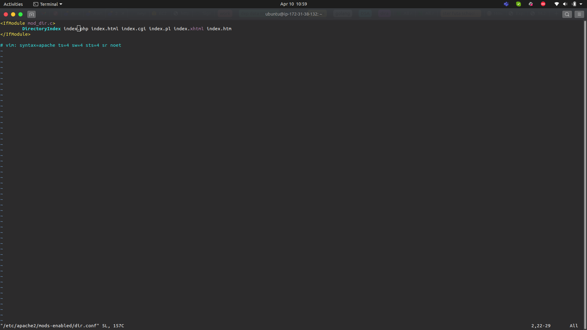

## Steps

### 1. Installing Apache and updating the firewall

- Created an EC2 instance in AWS and ensured Ubuntu was running

- Established a connection to the server via **ssh** connection using the command `ssh -i "darey-ec2.pem" ubuntu@ec2-34-249-160-234.eu-west-1.compute.amazonaws.com`

- Installed apache and verified that ist is running as a service in our OS using commands:
    - `sudo apt update`
    - `sudo apt install apache2`
    - `sudo systemctl status apache2`

- Added a rule to EC2 configuration to open inbound connection through port 80 and we can access it locally and from the Internet

- Retrieved the Public IP address to use by using `curl -s http://169.254.169.254/latest/meta-data/public-ipv4`

### 2. Installing Mysql

- Installed Mysql DB on the server and set up password to the DB using the commands:
    - `sudo apt install mysql-server`
    - `sudo mysql_secure_installation`

### 3. Installing PHP

- Insalled **php** package to process php codes, **php-mysql** to allow php to connect to mysql-based databases and **libapache2-mod-php** to enable Apache handle PHP files using `sudo apt install php libapache2-mod-php php-mysql`

### 4. Creating a virtual host for your website using apache

- set up a domain called *`projectlamp`* and Create the directory for projectlamp using `sudo mkdir /var/www/projectlamp`
- assign ownership of the directory with your current system user using `sudo chown -R $USER:$USER /var/www/projectlamp`
- create and open a new configuration file in Apache’s sites-available using `sudo vi /etc/apache2/sites-available/projectlamp.conf` to use VIM.

- use a2ensite command to enable the new virtual host: `sudo a2ensite projectlamp`
- disable Apache’s default website `sudo a2dissite 000-default`
- make sure your configuration file doesn’t contain syntax errors `sudo apache2ctl configtest`

- Create an index.html file in that location so that we can test that the virtual host works as expected:
`sudo echo 'Hello LAMP from hostname' $(curl -s http://169.254.169.254/latest/meta-data/public-hostname) 'with public IP' $(curl -s http://169.254.169.254/latest/meta-data/public-ipv4) > /var/www/projectlamp/index.html`

### 5. Enabling PHP on the website
- change the order of precedence between index.html and index.php so that index.php > index.html `sudo vim /etc/apache2/mods-enabled/dir.conf`

- reload apache and create index.php file

